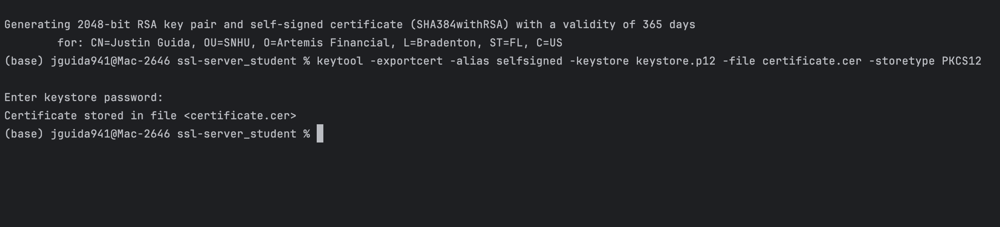
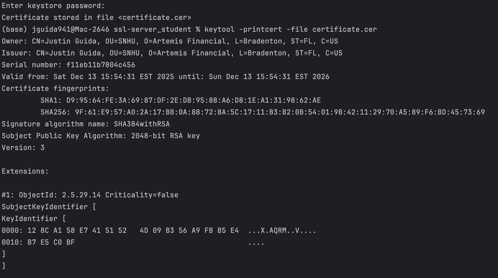
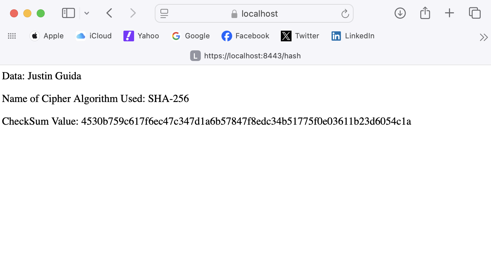
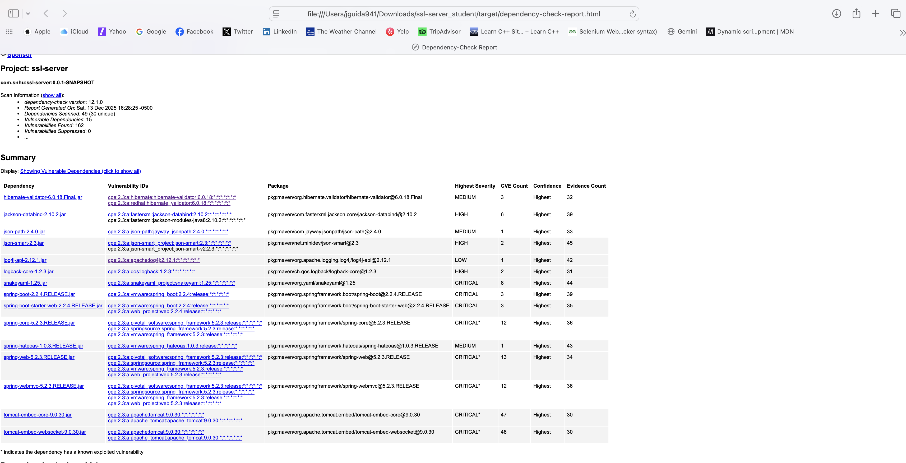
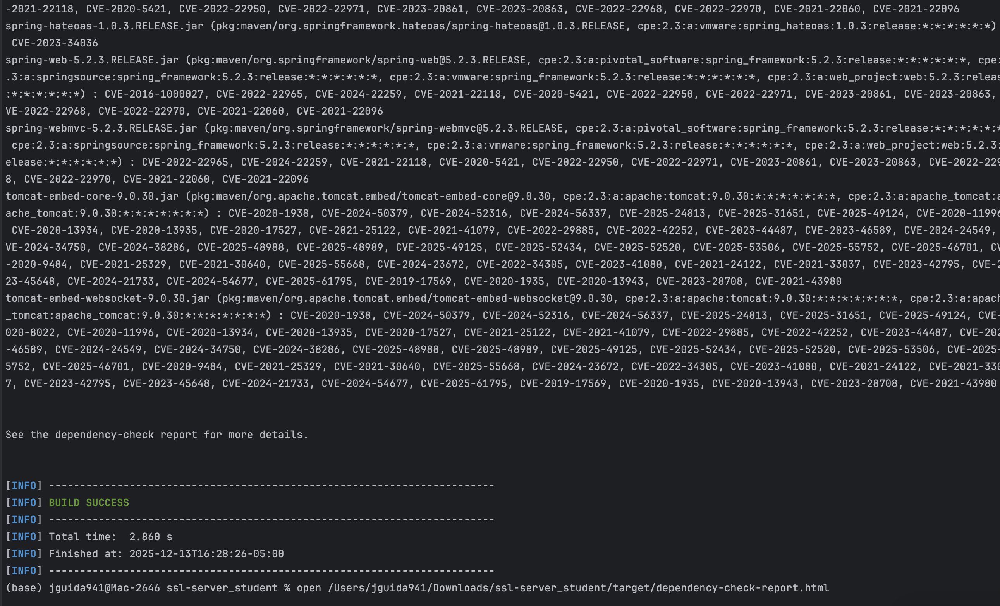

# Artemis Financial - Secure Software Report

---

## 1. Algorithm Cipher

### My Recommended Cipher

Based on the Java Security Standard Algorithm Names document, I recommend using the Java cipher transformation:

**`AES/GCM/NoPadding`**

- **AES** comes from the Cipher Algorithm Names section.
- **GCM** (Galois/Counter Mode) comes from the Cipher Algorithm Modes section.
- **NoPadding** comes from the Cipher Algorithm Paddings section.
- The combined transformation `AES/GCM/NoPadding` is listed in the Security Algorithm Implementation Requirements table for JDK 9 and later.

This gives a standard, supported cipher I can use directly with `Cipher.getInstance("AES/GCM/NoPadding")` in Java.

### Security Best Practices

**What security protection best practices do you need to consider defending against various types of security attacks?**

To protect Artemis Financial from common attacks, I would follow these best practices:

- Use strong, modern algorithms from the list, like AES, instead of older ones such as DES, DESede, or RC4, which are still in the table but are considered weak now.
- Use an authenticated mode. GCM is an AEAD mode that provides both confidentiality and integrity. This would help to block attackers who try to read or modify data.
- Use strong key sizes, such as 128-bit or 256-bit AES keys, created with KeyGenerator using the AES algorithm from the KeyGenerator Algorithms section.
- Use a secure random source from the SecureRandom Number Generation Algorithms section, such as DRBG or NativePRNGNonBlocking, to generate the keys, IVs, and nonces.
- Use the cipher inside TLS by configuring SSLContext with TLS 1.3 (preferred) or TLS 1.2 (minimum) from SSLContext Algorithms, and enabling strong AES GCM suites from the JSSE Cipher Suite Names list as I learned about from the resources. TLS 1.3 is now the recommended baseline for financial applications as it removes weak cipher negotiation and provides better performance.
- Store keys in a KeyStore of type PKCS12 and restrict access, instead of leaving keys in files or code.

### Risks of Recommendation

**What are the risks of your recommendation?**

There are still a few risks with AES/GCM/NoPadding:

- GCM needs a unique IV or nonce every time we encrypt with the same key. If an IV is reused, GCM security can break.
- If keys generated with `KeyGenerator("AES")` are stored in plain text files, logs, or environment variables instead of a protected PKCS12 keystore, an attacker could steal them.
- The standard names document still includes weak algorithms like MD5, SHA-1, DES, and RC4. If someone enables those in TLS or uses them elsewhere, they will weaken the system.
- If the code ignores the GCM authentication tag or does not check it, an attacker could tamper with data even though AES is used.

### Government Regulations

**What government regulations do you need to consider? How will these regulations be met?**

For Artemis Financial, I would think about this:

- **NIST and FIPS guidance.** AES is an approved symmetric cipher, and GCM is a recommended mode. Using AES/GCM/NoPadding with SHA-2 hashes (for example SHA-256 from the MessageDigest Algorithms section) lines up with current NIST style recommendations.
- **PCI DSS**, if cardholder data is involved. PCI expects "strong cryptography," which usually means TLS 1.2 or 1.3 with AES GCM and SHA-2. Using SSLContext with TLS 1.3 (or TLS 1.2 as minimum) and AES GCM suites from the JSSE Cipher Suite Names section meets that bar when combined with proper key management. NIST required organizations to add TLS 1.3 support by January 2024.
- **Privacy and banking laws** like GLBA, and possibly GDPR. These laws do not list exact ciphers, but they require appropriate technical controls. Choosing AES, SHA-2, and modern TLS from the official Java standard names set is a clear way to show that Artemis is following industry standards.

By using AES/GCM/NoPadding, TLS 1.3 (or TLS 1.2 as minimum), SHA-2 digests, and secure key storage, Artemis can show that it is using widely recognized algorithms that match these regulations, which is needed for a financial company that deals with sensitive data.

### How the Cipher Will Be Used

**How will this algorithm cipher be used?**

I would use AES/GCM/NoPadding in two main ways:

#### 1. Data in Transit
   - Configure SSLContext with algorithm TLS 1.3 (preferred) or TLS 1.2 (minimum).
   - Enable JSSE cipher suites that use AES GCM from the JSSE Cipher Suite Names table, such as `TLS_ECDHE_RSA_WITH_AES_256_GCM_SHA384`.
   - This protects HTTPS traffic between clients and Artemis's web services, and internal service-to-service traffic.

#### 2. Data at Rest
   - In the Java application, use `Cipher.getInstance("AES/GCM/NoPadding")` to encrypt sensitive fields before storing them in the database or backups.
   - Generate keys with `KeyGenerator.getInstance("AES")`.
   - Use SecureRandom (for example DRBG) to create 12-byte IVs for GCM.
   - Store keys in a KeyStore of type PKCS12, protected with strong passwords and access controls.

### Why This Is the Best Cipher

**What is the best cipher, and why?**

From the Cipher Algorithm Names section, there are several choices, such as AES, DES, DESede, Blowfish, RC2, RC4, and RSA.

For a modern financial system, AES in GCM mode is the best choice because:

- AES is the current standard block cipher and is required in the Security Algorithm Implementation Requirements table.
- GCM provides both encryption and integrity, so it reduces the chance of design mistakes that happen when you try to bolt on a separate MAC.
- The transformation `AES/GCM/NoPadding` is explicitly listed as a required transformation, so it is guaranteed to be available in standard Java.
- AES GCM is widely supported and performs well.

Because of this, AES/GCM/NoPadding is a strong, standard, and practical choice for Artemis.

**What are the reasons why you might not choose the most secure cipher?**

Even if a cipher or suite looks most secure on paper, there are reasons not to always pick the most advanced option:

- Some clients or legacy systems (which happens a lot in real-world scenarios) might not support the newest or most exotic cipher suites. AES GCM suites have broad support.
- Using very unusual algorithms increases the chance of configuration errors, because most examples and libraries assume AES and SHA-2.
- Auditors and support teams expect to see AES, SHA-2, and TLS 1.2 or higher. If we pick rare algorithms, it can make reviews harder.
- Many tools, HSMs, and monitoring systems are tested heavily with AES-based suites, not with every option listed in the JSSE table.

So, in practice, AES/GCM/NoPadding plus standard AES GCM TLS suites are a better fit than chasing the absolute "strongest looking" cipher on the list.

---

### Justification

#### Hash Functions and Bit Levels

**Explain the purpose of the cipher's hash functions and bit levels.**

In the MessageDigest Algorithms section, the document lists hashes like SHA-256, SHA-384, SHA-512, and SHA-3 variants with different bit lengths.

Their main purposes are:

- To create a fixed-size digest of data, so any change to the data changes the digest.
- To support digital signatures and certificate validation, for example SHA256withRSA from the Signature Algorithms section.
- To detect tampering or corruption.

The bit level (for example, 256 bits for SHA-256) shows how strong the hash is. Higher bit lengths make it harder to find collisions or fake messages.

In the Artemis design, AES GCM handles message integrity at the cipher level, but TLS, signatures, and certificates still depend on these hash functions and their bit lengths.

#### Random Numbers, Symmetric vs Non-Symmetric Keys

**Explain the use of random numbers, symmetric versus non-symmetric keys, and so on.**

From the SecureRandom Number Generation Algorithms section:

- DRBG, NativePRNG, and NativePRNGNonBlocking are examples of secure random number generators.
- These are used to:
  - Generate AES keys using `KeyGenerator("AES")`.
  - Generate IVs and nonces for GCM.
  - Generate RSA or EC key pairs using `KeyPairGenerator("RSA")` or `KeyPairGenerator("EC")`.

**Keys:**

- **Symmetric keys** (like AES keys) use the same secret key for encryption and decryption. They are fast and good for encrypting a lot of data.
- **Non-symmetric, or asymmetric, keys** (like RSA or EC keys) use a public key and a private key. These are used for TLS handshakes, digital signatures, and certificates, not for bulk data.

**To sum this up:**

- Asymmetric algorithms, such as RSA with SHA256withRSA, will handle identity and key exchange.
- Symmetric AES/GCM/NoPadding will handle the day-to-day encryption of financial data once a secure session is established.

#### History and Current State of Encryption Algorithms

**Describe the history and current state of encryption algorithms.**

The Oracle document reference we were given itself shows the history:

- Older ciphers such as DES and DESede (Triple DES) are still listed in Cipher Algorithm Names, but they use shorter keys and are now considered legacy.
- Ciphers like RC4 also appear, but they have known weaknesses and are not recommended for new systems.
- AES was introduced later and replaced DES and 3DES as the standard block cipher. That is why AES appears in multiple sections: AlgorithmParameters, Cipher, KeyGenerator, and so on.
- In the MessageDigest Algorithms list, MD5 and SHA-1 still show up, but modern practice is to use SHA-256 or stronger, because MD5 and SHA-1 have collisions.

Today, the common pattern for secure systems, especially in finance, is:

- Use AES (often in GCM mode) for symmetric encryption.
- Use SHA-2 or SHA-3 for hashing and signatures.
- Use RSA or elliptic curve algorithms for key exchange and digital signatures.
- Use TLS 1.3 (preferred) or TLS 1.2 (minimum) with strong cipher suites from the JSSE list.

That is why, based on the Java Security Standard Algorithm Names document and Artemis Financial's needs, AES/GCM/NoPadding is a good choice for the encryption algorithm cipher.

### References

Java security standard algorithm names. (n.d.). https://docs.oracle.com/javase/9/docs/specs/security/standard-names.html#cipher-algorithm-names

---

## 2. Certificate Generation

> **Requirement:** Generate appropriate self-signed certificates using the Java Keytool in Eclipse.

### Steps Completed

- [x] Generated self-signed certificate
- [x] Exported certificate as CER file
- [x] Screenshot of CER file included

### Certificate Screenshots

**Certificate Generation:**


**Certificate Export:**



**Certificate Details:**



### Notes

*Your notes here...*

---

## 3. Deploy Cipher

> **Requirement:** Deploy and implement the cryptographic hash algorithm by refactoring code. Demonstrate functionality with a checksum verification.

### Implementation

Implemented SHA-256 checksum verification in `ServerApplication.java` using Java's `MessageDigest` class. The `/hash` endpoint displays the data string, algorithm name, and computed checksum.

### Checksum Verification

- [x] Screenshot showing name and unique data string included


---

## 4. Secure Communications

> **Requirement:** Verify secure communication by converting HTTP to HTTPS protocol.

### Steps Completed

- [x] Refactored application.properties for HTTPS
- [x] Compiled and ran refactored code
- [x] Verified `https://localhost:8443/hash` works
- [x] Screenshot of secure webpage included

### HTTPS Verification

Configured `application.properties` with SSL settings using PKCS12 keystore. The application now runs on port 8443 with HTTPS enabled.



### Notes

The browser shows a security warning because we're using a self-signed certificate. In production, you would use a certificate signed by a trusted Certificate Authority (CA).

---

## 5. Secondary Testing

> **Requirement:** Run secondary static testing using the dependency-check tool.

### Results

- [x] Refactored code executed without errors (screenshot included)
- [x] Dependency-check report included

### Dependency-Check Configuration

Used OWASP Dependency-Check Maven Plugin (version 12.1.0) configured in `pom.xml`:

```xml
<plugin>
    <groupId>org.owasp</groupId>
    <artifactId>dependency-check-maven</artifactId>
    <version>12.1.0</version>
</plugin>
```

Run command: `./mvnw dependency-check:check`

### Vulnerabilities Found

The scan identified vulnerabilities in the following dependencies:

| Dependency                | Critical CVEs                                 |
|---------------------------|-----------------------------------------------|
| tomcat-embed-core-9.0.30  | CVE-2020-1938, CVE-2024-50379, CVE-2025-24813 |
| spring-core-5.2.3.RELEASE | CVE-2022-22965 (Spring4Shell)                 |
| jackson-databind-2.10.2   | CVE-2020-25649, CVE-2020-36518                |
| log4j-api-2.12.1          | CVE-2020-9488                                 |
| snakeyaml-1.25            | CVE-2022-1471                                 |
| logback-core-1.2.3        | CVE-2021-42550                                |

**Total: 162+ CVEs identified across all dependencies**

### Dependency-Check Report



### Build Success (Terminal Output)



### Notes

These vulnerabilities exist because the project uses Spring Boot 2.2.4.RELEASE (released February 2020), which bundles older versions of libraries. In a production environment, upgrading to the latest Spring Boot version would resolve most of these vulnerabilities. For this educational project, the dependency-check successfully demonstrates the importance of scanning for known vulnerabilities in third-party dependencies.

---

## 6. Functional Testing

> **Requirement:** Identify syntactical, logical, and security vulnerabilities by manually reviewing the code.

### Findings

*Your findings here...*

- [ ] Screenshot of refactored code executed without errors included

---

## Summary

### Areas of Security Addressed

*Your response here...*

### Process for Adding Security Layers

*Your response here...*

### Industry Standard Best Practices Applied

*Your response here...*

### Value to Company Well-Being

*Your response here...*